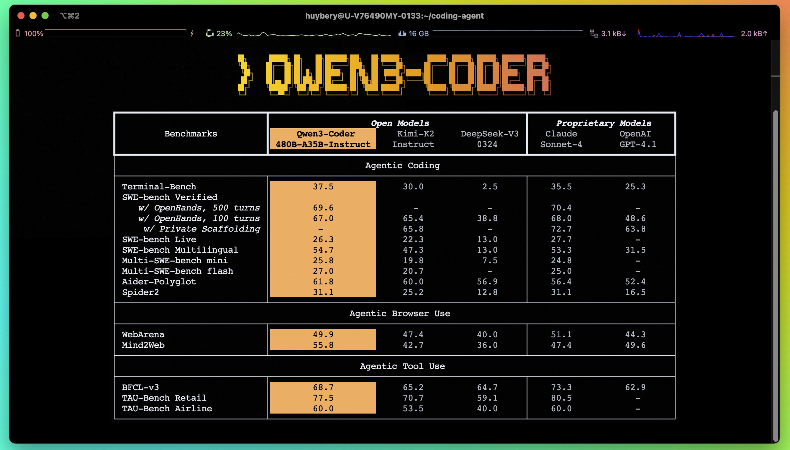
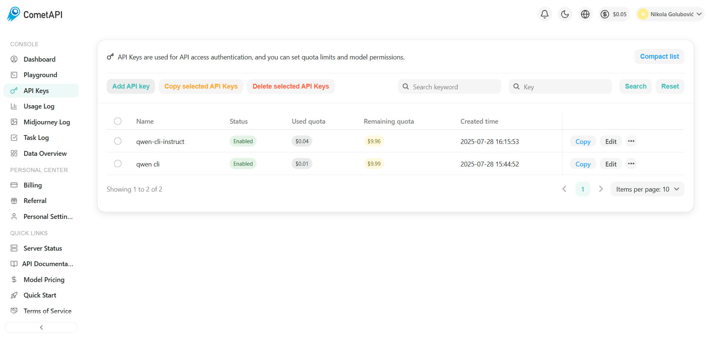

# Tihi zemljotres u AI industriji

*(Tekst je ažuriran sa stanjem u julu 2025. godine)*
# Kineski AI modeli revolucionišu programiranje: Od cenovnih šokova do praktičnih rešenja

## Tihi zemljotres u AI industriji

U svetu gde se tehnološki napredak meri kroz višegodišnje cikluse, ono što se desilo u julu 2025. godine predstavlja pravi zaokret. Kineski AI startapovi nisu samo objavili nove modele, oni su fundamentalno redefinisali ekonomiju veštačke inteligencije za programere širom sveta.

### Cenovni šok koji menja sve

Brojke govore jasnu priču o revoluciji koja se odvija pred našim očima. DeepSeek V3 košta samo $0.27 po milioneu input tokena, što je **30 puta jeftinije** od GPT-4o modela koji košta $2.50[1](https://research.aimultiple.com/llm-pricing/). Alibaba je lansirala Qwen3-235B[2](https://huggingface.co/Qwen/Qwen3-Coder-480B-A35B-Instruct) model koji konkuriše GPT-4 performansama po četvrtini cene[2](https://www.scmp.com/tech/big-tech/article/3318747/how-chinas-open-source-ai-helping-deepseek-alibaba-take-silicon-valley). Z.ai[2](https://huggingface.co/zai-org/GLM-4.5) je postavila novi industrijski rekord sa GLM-4.5 po najnižoj ceni—samo $0.11 po milion tokena[3](https://www.cnbc.com/2025/07/28/chinas-latest-ai-model-claims-to-be-even-cheaper-to-use-than-deepseek.html).

Ali ova cenovna revolucija nije slučajnost. To je rezultat sistemskog pristupa koji Kina sprovodi kroz potpunu demokratizaciju AI tehnologije. Za razliku od zatvorenih, vlasničkih modela koji dominiraju Zapadom, kineski pristup počiva na **potpunoj otvorenosti**—source kod, težine modela, čak i podaci za treniranje su javno dostupni.

Kada je OpenAI u julu 2024. blokirao pristup kineskim korisnicima, Kina je usvojila drugačiji pristup - stvaranje alternative koja je **dostupnija, jeftinija i otvorenija**. Omogućavajući programerima širom sveta da grade na njihovim sistemima, Kina potencijalno uspostavlja kineske modele kao globalne standarde.

Usred ove bitke između Kine i SAD-a, Evropa priprema treći put. ETH Zurich i EPFL najavljuju objavljivanje potpuno otvorenog, multilangualnog LLM-a tokom leta 2025. Ovaj model podržava preko **1.500 jezika** sa 40% ne-engleskih trening podataka[4](https://ethz.ch/en/news-and-events/eth-news/news/2025/07/a-language-model-built-for-the-public-good.html).

## Praktični vodič: Kompletno podešavanje Qwen Coder-a

Ranije ove nedelje Alibaba je izbacio najnoviji MoE (Mixture of Expert) model Qwen3-Coder, veličine 480 milijardi parametara (od čega 35 milijardi aktivnih). Ne samo da su objavili besplatan Qwen3-coder, već su objavili i open source CLI alat koji je razvijen kao nadogradnja na već postojeći Google-ov open source Gemini CLI. Ono što je impresivno je da Qwen3-Coder prima 256.000+ ulaznih tokena, sa podrškom i do milion tokena. Reference radi, ovo je dovoljna količina informacije da model obradi celu vašu kod-bazu.



Qwen3-Coder je dostupan svima za nadogradnju i rad, ali ukoliko mislite da ga možete pokrenuti na svom računaru, evo male pomoći: Ne možete. Naime, model sa 480 milijardi parametara, poput Qwen3-Coder, zahteva ogromnu pokretačku snagu GPU-a, čija cena ide do par desetina, do čak i do stotine hiljada evra. Mnogo relniji pristup, uz male dodatne troškove, je korišćenjem API poziva, koristeći se API ključem nekog od provajdera.

Za programere spremne da iskoriste prednosti najnovijih kineskih AI modela, evo detaljnog vodiča za postavku Qwen3-Coder sistema sa naprednim reasoning mogućnostima. 

### Korak 1: Priprema razvojnog okruženja

```bash
# Instaliraj Node.js 20+
curl -qL https://www.npmjs.com/install.sh | sh

# Verifikuj instalaciju
node --version
npm --version

# Instaliraj Qwen Code CLI globalno
npm install -g @qwen-code/qwen-code

# Verifikuj instalaciju
qwen --version
```

### Korak 2: Registracija i konfiguracija CometAPI servisa

CometAPI predstavlja optimizovano rešenje za pristup kineskim AI modelima:

1. Idi na https://www.cometapi.com/
2. Registruj se za besplatni nalog
3. Dobićeš **0.10 $** za testiranje
4. Idi na **API keys** -> **Add API key**

5. Unesi ime, i kopiraj vrednost ključa

Qwen Code komunicira s LLM modelima preko OpenAI SDK, stoga je neophodno definisati sledeće promeljive (ili jednostavnije definisati u .env fajlu) 

```bash
# Postavi environment varijable (dodaj u ~/.bashrc ili ~/.zshrc ukoliko želiš da se vrednost sačuva u novim terminalima)
export OPENAI_API_KEY="your_cometapi_key_here"
export OPENAI_BASE_URL="https://api.cometapi.com/v1"
export OPENAI_MODEL="qwen3-coder-plus"

# Reloaduj shell ili izvršni source
source ~/.bashrc
```

### Korak 3: 

**Opcija A: Continue ekstenzija**
1. Instaliraj "Continue" ekstenziju u VS Code[35][36]
2. Otvori Command Palette (Ctrl+Shift+P)
3. Kucaj "Continue: Open Config"
4. Dodaj konfiguraciju:

```json
{
  "models": [
    {
      "title": "Qwen3 Coder",
      "provider": "openai",
      "model": "qwen3-coder-plus",
      "apiKey": "your_cometapi_key",
      "apiBase": "https://api.cometapi.com/v1"
    }
  ]
}
```

**Opcija B: Cline ekstenzija**
Koristi istu konfiguraciju ali sa Cline interface-om za agenčko ponašanje[36].

### Korak 4: Pokretanje i osnovno testiranje

```bash
# Pokreni Qwen Code CLI
qwen

# Otvoriće se polje za unos
> Objasni JWT mehanizam autentikacije

# Test sa fajlom
> Analiziraj @./src/main.js

# Test sa celom codebase
> Generiši README fajl za ovaj projekat

> Predloži potencijalna poboljšanja ili refaktorisanje ovog repozitorijuma?
```

### Korak 6: Integracija sa postojećim workflow-om

**CI/CD integracija:**
```yaml
# .github/workflows/ai-review.yml
name: AI Code Review
on: [pull_request]
jobs:
  ai-review:
    runs-on: ubuntu-latest
    steps:
      - uses: actions/checkout@v2
      - name: Setup Node.js
        uses: actions/setup-node@v2
        with:
          node-version: '20'
      - name: Install Qwen CLI
        run: npm install -g @qwen-code/qwen-code
      - name: AI Review
        run: qwen review --pr-diff
        env:
          OPENAI_API_KEY: ${{ secrets.COMETAPI_KEY }}
```

### Korak 7: Optimizacija performansi i troškova

```bash
# Konfiguriši caching za česte upite
qwen config set cache-enabled true
qwen config set cache-ttl 3600

# Postavke za cost optimization
qwen config set max-tokens 2048
qwen config set temperature 0.3

# Bulk processing za veće projekte
qwen batch-process --input-dir ./src --output-format json
```

### Primeri praktične upotrebe sa reasoning

**Kompleksna analiza koda:**
```bash
# Duboka analiza sa objašnjenjem
qwen analyze --deep-reasoning ./complex-algorithm.py
```

Qwen3-Coder će:
1. **Analizirati strukturu** koda
2. **Identifikovati** potencijalne probleme
3. **Objasniti reasoning** za svaki predlog
4. **Predložiti optimizacije** sa objašnjenjem zašto

**Refactoring sa step-by-step objašnjenjem:**
```bash
qwen refactor --explain-steps ./legacy-code.js
```

Model će pokazati:
- **Zašto** određeni kod treba refaktorisati
- **Kako** će promena uticati na performanse
- **Alternativna rešenja** sa pros/cons analizom

### Troubleshooting česti problemi

**Problem: Rate limiting**
```bash
# Konfiguriši retry strategiju
qwen config set retry-attempts 3
qwen config set retry-delay 1000
```

**Problem: Veliki fajlovi**
```bash
# Chunking za velike fajlove
qwen config set chunk-size 8192
qwen config set overlap-size 256
```

**Problem: Context overflow**
```bash
# Automatsko skraćivanje konteksta
qwen config set auto-truncate true
qwen config set context-priority code-focus
```

## Zakjučak: Nova era programiranja

Kombinacija drastično smanjenih troškova, proširenih kontekst prozora (od skromnih 8.000 do preko 128.000+ tokena[16][17]), i naprednih reasoning mogućnosti čini 2025. godinu prekretnicom za programere. Sa alatima kao što je Qwen3-Coder, kompleksne analize codebase-a koje su ranije bile privilagija velikih korporacija sada su dostupne svima.

Ova tehnološka demokratizacija nije samo o jeftinijim API pozivima—to je fundamentalna promena u tome kako pristupamo rešavanju problema u programiranju. AI agenti sa reasoning mogućnostima mogu da ne samo odgovore na naša pitanja, već da **objasne svoje razmišljanje**, **predlože alternative**, i **adaptiraju se** na specifične potrebe svakog projekta.

---

**Reference:**
[1-40] - Kompletna lista referenci dostupna u originalnim izvorima linkovanim kroz tekst